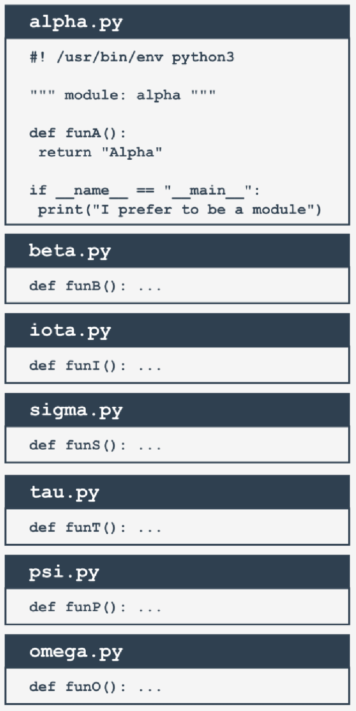
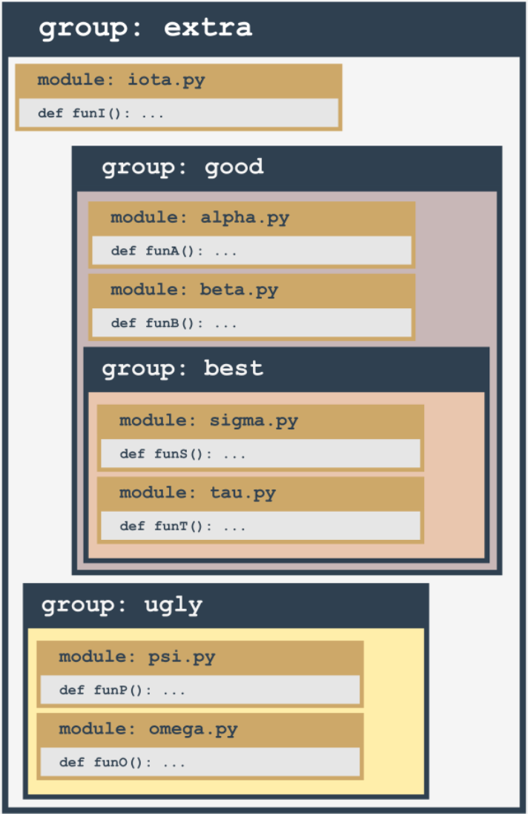

## Your first package: step 1
Imagine that in the not-so-distant future you and your associates write a large number of Python functions.

Your team decides to group the functions in separate modules, and this is the final result of the ordering:



```python
#! /usr/bin/env python3

""" module: alpha """

def funA():
    return "Alpha"

if __name__ == "__main__":
    print("I prefer to be a module.")
```

**Note:** <br>
We've presented the whole content for the `alpha.py` module only - assume that all the modules look similar (they contain one function named `funX`, where X is the first letter of the module's name).

<br><br>

## Your first package: step 2
Suddenly, somebody notices that these modules form their own hierarchy, so putting them all in a flat structure won't be a good idea.

After some discussion, the team comes to the conclusion that the modules have to be grouped. All participants agree that the following tree structure perfectly reflects the mutual relationships between the modules:



Let's review this from the bottom up:
- the `ugly` group contains two modules: `psi` and `omega`;
- the `best` group contains two modules: `sigma` and `tau`;
- the `good` group contains two modules (`alpha` and `beta`) and one subgroup (`best`)
- the `extra` group contains two subgroups (`good` and `bad`) and one module (`iota`)

Does it look bad? Not at all - analyze the structure carefully. It resembles something, doesn't it?

It looks like a **directory structure**.

Let's build a tree reflecting projected dependencies between the modules.