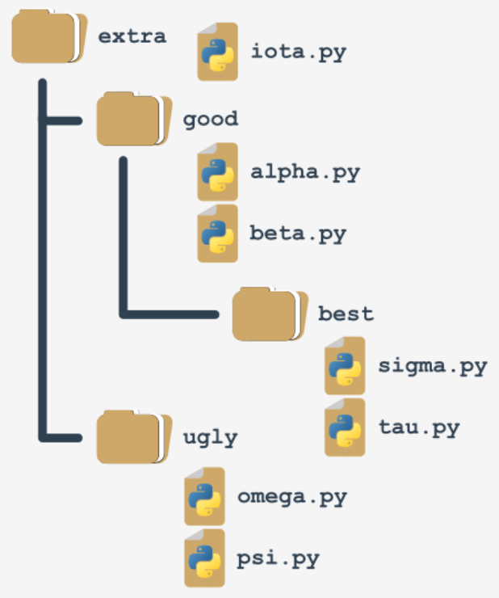
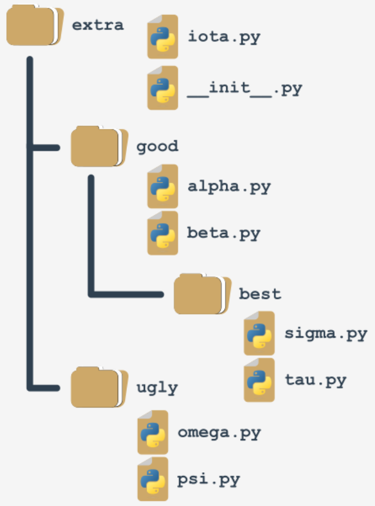

## Your first package: step 1
Imagine that in the not-so-distant future you and your associates write a large number of Python functions.

Your team decides to group the functions in separate modules, and this is the final result of the ordering:


```python
#! /usr/bin/env python3

""" module: alpha """

def funA():
    return "Alpha"

if __name__ == "__main__":
    print("I prefer to be a module.")
```

**Note:** <br>
We've presented the whole content for the `alpha.py` module only - assume that all the modules look similar (they contain one function named `funX`, where X is the first letter of the module's name).

<br><br>

## Your first package: step 2
Suddenly, somebody notices that these modules form their own hierarchy, so putting them all in a flat structure won't be a good idea.

After some discussion, the team comes to the conclusion that the modules have to be grouped. All participants agree that the following tree structure perfectly reflects the mutual relationships between the modules:


Let's review this from the bottom up:
- the `ugly` group contains two modules: `psi` and `omega`;
- the `best` group contains two modules: `sigma` and `tau`;
- the `good` group contains two modules (`alpha` and `beta`) and one subgroup (`best`)
- the `extra` group contains two subgroups (`good` and `bad`) and one module (`iota`)

Does it look bad? Not at all - analyze the structure carefully. It resembles something, doesn't it?

It looks like a **directory structure**.

Let's build a tree reflecting projected dependencies between the modules.

<br><br>

## Your first package: step 3

This is how the tree currently looks:




Such a structure is almost a package (in the Python sense). It lacks the fine detail to be both functional and operative. We'll complete it in a moment.

If you assume that `extra` is the name of a **newly created package** (think of it as the **package's root**), it will impose a naming rule which allows you to clearly name every entity from the tree.

For example:
- the location of a function name `funT()` from the `tau` package may be described as:

  ```python
  extra.good.best.tau.funT()
  ```

- a function marked as:

  ```python
  extra.ugly.psi.funP()
  ```

  comes from `psi` module being stored in the `ugly` subpackage of the `extra` package.

<br><br>

## Your first package: step 4

There are two questions to answer:

- **how** do you transfer such a tree (actually, a subtree) into a real Python **package** (in other words, how do you convince Python that such a tree is now just a bunch of junk files, but set of modules)?
- **where** do you put the subtree to make it accessible to Python?

The first question has a surprise asnwer: **package, like modules, may require initialization**.

The initialization of a module is done by an _unbound_ code (not a part of any function) located inside the module's file. As a package is not a file, this technique is useless for initializing packages. 

you need to use a different trick instead - Python expects that there is a file with a very unique name inside the package's filder: `__init__.py`

The content of the file is executed when any of the package's modiles is **imported**. If you don't want any special initializations, you can leae the file empty, but you MUST NOT omit it. 

## Your first package: step 5


