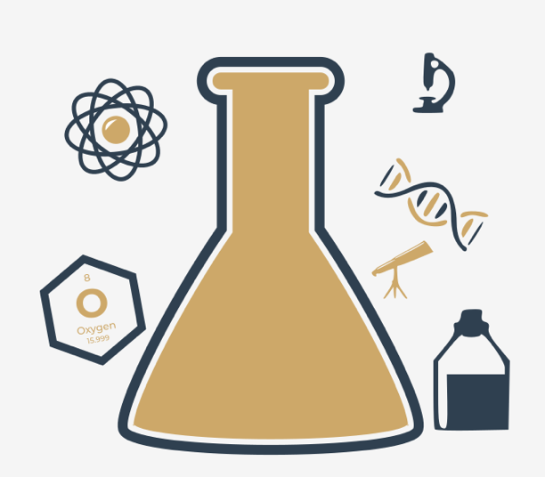

## Python packaging ecosystem and hot to use it

Python is a very powerful instrument – we hope you've experienced this yourself already. Many people from around the world feel this way, and they use Python on a regular basis to develop what they can do in many completely different fields of activity. This means that Python has become **an interdisciplinary tool** employed in countless applications. We can’t go through all the spheres in which Python brilliantly shows off its abilities, so let us just tell you about the most impressive ones.

First of all, Python has turned into **a leader of research on artificial intelligence**. Data mining, one of the most promising modern scientific disciplines, utilizes Python as well. Mathematicians, psychologists, geneticists, meteorologists, linguists – all these people already use Python, or if they don’t already, we’re sure that they will very soon. There is no escaping this trend.

Of course, it doesn’t make any sense to get all Python users to write their code from scratch, keeping them perfectly isolated from the outside world and from other programmers' achievements. This would be both unnatural and counterproductive.

The most preferable and efficient thing is to enable all Python community members to freely exchange their codes and experiences. In this model, nobody is forced to start work from scratch, as there’s a high probability that someone else has been working on the same (or a very similar) problem.

As you know, Python was created as open-source software, and this also works as an invitation for all coders to maintain the whole Python ecosystem as an open, friendly, and free environment. To make the model work and evolve, some additional tools should be provided, tools that help the creators to publish, maintain, and take care of their code.

These same tools should help users to make use of the code, both the already existing code, and also the new code appearing every day. Thanks to that, writing new code for new challenges is not like building a new house, starting at the foundations.

Moreover, the programmer is free to modify someone else's code in order to adapt it to their own needs, and in effect build a completely new product that can be used by another developer. The process seems to have no end. Fortunately.

To make this world go round, two basic entities have to be established and kept in motion: **a centralized repository** of all available software packages; and a tool allowing users to **access the repository**. Both these entities already exist and can be used at any time.

The repository (or _repo_ for short) we mentioned before is named **PyPI** (it's short for Python Package Index) and it's maintained by a workgroup named the Packaging Working Group, a part of the Python Software Foundation, whose main task is to support Python developers in efficient code dissemination.

You can find their website here:
https://wiki.python.org/psf/PackagingWG

The PyPI website (administered by PWG) is located at the address:
https://pypi.org

When we popped in there for a while at the beginning of June 2020, we found that PyPI was home to 237,515 projects, consisting of 2,877,545 files managed by 427,487 users.

These three numbers alone clearly show the potency of the Python community and the importance of developer cooperation.

We must point out that PyPI is not the only existing Python repository. On the contrary, there are lots of them, created for projects and led by many larger and smaller Python communities. It's likely that someday you and your colleagues may want to **create your own repos**.

Anyway, PyPI is the most important Python repo in the world. If we modify the classic saying a little, we can state that “all Python roads lead to PyPl”, and that’s no exaggeration at all.