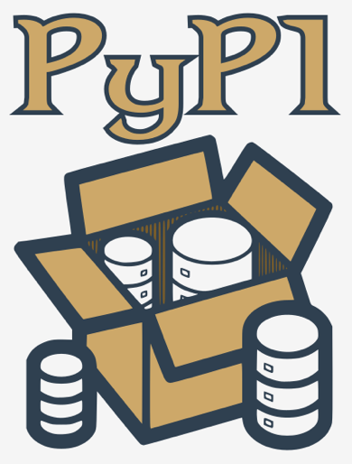

## Python packaging ecosystem and hot to use it

Python is a very powerful instrument – we hope you've experienced this yourself already. Many people from around the world feel this way, and they use Python on a regular basis to develop what they can do in many completely different fields of activity. This means that Python has become **an interdisciplinary tool** employed in countless applications. We can’t go through all the spheres in which Python brilliantly shows off its abilities, so let us just tell you about the most impressive ones.

First of all, Python has turned into **a leader of research on artificial intelligence**. Data mining, one of the most promising modern scientific disciplines, utilizes Python as well. Mathematicians, psychologists, geneticists, meteorologists, linguists – all these people already use Python, or if they don’t already, we’re sure that they will very soon. There is no escaping this trend.

Of course, it doesn’t make any sense to get all Python users to write their code from scratch, keeping them perfectly isolated from the outside world and from other programmers' achievements. This would be both unnatural and counterproductive.

The most preferable and efficient thing is to enable all Python community members to freely exchange their codes and experiences. In this model, nobody is forced to start work from scratch, as there’s a high probability that someone else has been working on the same (or a very similar) problem.

As you know, Python was created as open-source software, and this also works as an invitation for all coders to maintain the whole Python ecosystem as an open, friendly, and free environment. To make the model work and evolve, some additional tools should be provided, tools that help the creators to publish, maintain, and take care of their code.

These same tools should help users to make use of the code, both the already existing code, and also the new code appearing every day. Thanks to that, writing new code for new challenges is not like building a new house, starting at the foundations.

Moreover, the programmer is free to modify someone else's code in order to adapt it to their own needs, and in effect build a completely new product that can be used by another developer. The process seems to have no end. Fortunately.

To make this world go round, two basic entities have to be established and kept in motion: **a centralized repository** of all available software packages; and a tool allowing users to **access the repository**. Both these entities already exist and can be used at any time.


The repository (or _repo_ for short) we mentioned before is named **PyPI** (it's short for Python Package Index) and it's maintained by a workgroup named the Packaging Working Group, a part of the Python Software Foundation, whose main task is to support Python developers in efficient code dissemination.

You can find their website here:
https://wiki.python.org/psf/PackagingWG

The PyPI website (administered by PWG) is located at the address:
https://pypi.org


When we popped in there for a while at the beginning of June 2020, we found that PyPI was home to 237,515 projects, consisting of 2,877,545 files managed by 427,487 users.

These three numbers alone clearly show the potency of the Python community and the importance of developer cooperation.



We must point out that PyPI is not the only existing Python repository. On the contrary, there are lots of them, created for projects and led by many larger and smaller Python communities. It's likely that someday you and your colleagues may want to **create your own repos**.

Anyway, PyPI is the most important Python repo in the world. If we modify the classic saying a little, we can state that “all Python roads lead to PyPl”, and that’s no exaggeration at all.

<br><br>

## The PyPI repo: the Cheese Shop
The PyPI repo is sometimes referred to as the **Cheese Shop**. Really.

Does that sound a little strange to you? Don't worry, it’s all perfectly innocent.

We refer to the repo as a shop, because you go there for the same reasons you go to other shops: to fulfill your needs. If you want some cheese, you go to the cheese shop. If you want a piece of software, you go to the software shop. Fortunately, the analogy ends here – you don't need any money to take some software out of the repo shop.

PyPI is completely free, and you can just pick a code and use it – you’ll encounter neither cashier nor security guard. Of course, it doesn't absolve you from being polite and honest. You have to obey all the licensing terms, so don't forget to read them.

“OK”, you say, “the shop is clear now, but what does cheese have to do with Python?”

The Cheese Shop is one of the most famous Monty Python sketches. It depicts the surrealist adventure of an Englishman trying to buy some cheese. Unfortunately, the shop he visits (immodestly named Ye National Cheese Emporium) has no cheese in stock at all.

Of course, it's meant to be ironic. As you already know, PyPI has lots of software in stock and it's available 24/7. It's fully entitled to identify itself as _Ye International Python Software Emporium_.


PyPI is a very specific shop, not just because it offers all its products for free. It also requires a special tool to make use of it.

Fortunately, this tool is also free, so if you want to make your own digital cheeseburger by using the goods offered by the PyPI Shop, you’ll need a free tool named pip.

No, you haven't misheard. Just pip. It's another acronym, of course, but its nature is more complex than the previously mentioned PyPI, as it's an example of a recursive acronym, which means that the acronym refers to itself, which means that explaining it is an infinite process.

Why? Because pip means “_pip installs packages_”, and the pip inside “_pip installs packages_” means “_pip installs packages_” and ...

Let’s stop there. Thank you for your cooperation.

By the way, there are a few other very famous recursive acronyms. One of them is Linux, which can be interpreted as “_Linux is Not Unix_”.

<br><br>

## Hot to install _pip_

The question that should be put now is: how to get a proper cheese knife? In other words, how to ensure that pip is installed and ready to work?

The most precise answer is “it depends”. Really.

Some Python installations come with pip, some don't. What’s more, it doesn’t only depend on the OS you use, although this is a very important factor.

## _pip_ on MS Windows

The MS Windows Python installer already contains `pip`, and so no other steps need to be taken in order to install it. Unfortunately, if the PATH variable is misconfigured, `pip` may unavailable.

To verify that we haven’t misled you, try to do this:
- open the Windows console (`CMD` or `PowerShell`, whatever you prefer)
- execute the following command:

  ```python
  pip --version
  ```
- in the most optimistic scenario (and we really want that to happen) you'll see soemthing like this:

  ```powershell
  C: \Users \user>pip --version
  pip 19.2.3 from c: \program files\python3\lib\site-packages\pip (python 3.8)
  ```

- the absence of this message may mean that the PATH variable either incorrectly points to the location of the Python binaries, or doesn't point to it at all; for example, our PATH variable contains the following substring:

  ```
  C:\Program Files\Python3\Scripts\;C:\Program Files\Python3\;
  ```

- the easiest way to reconfigure the PATH variable is to **reinstall Python**, instructing the installer to set it for you.

## _pip_ on Linux

Different Linux distributions may behave differently when it comes to using pip. Some of them (like _Gentoo_), which are closely bound to Python and which use it internally, may have pip preinstalled and are instantly ready to work.

Don't forget that some Linuces may utilize more than one Python version concurrently, e.g., one Python 2 and one Python 3 coexisting side by side. Such systems may launch Python 2 as the default version, and it may be necessary to explicitly specify the program name as python3. In this case there may be two different _pips_ identified as pip (or _pip2_) and _pip3_. Check it carefully.

Open the terminal window and issue the following command:

```shell
user@host:   pip --version
pip 20.0.2 from /sr/lib64/python2.7/site-packages/pip (python 2.7)
```

An answer similar to the one shown in the previous picture determines that you've launched _pip_ from Python 2, so the next try should look as follows:

```shell
user@host:  pip3 --version
pip 20.0.2 from /us/lib64/python3.6/site-packages/pip (python 3.6)
```

As you can see, we’re now sure that we’re using the appropriate version of _pip_.