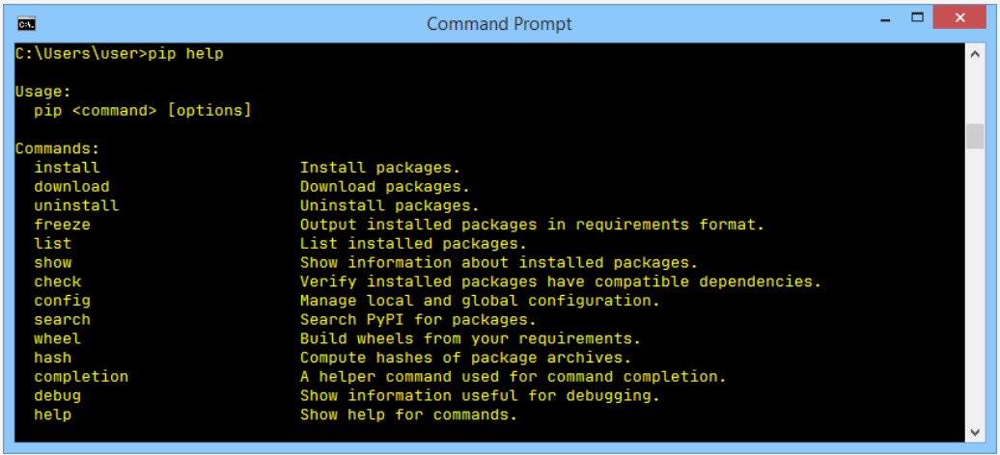
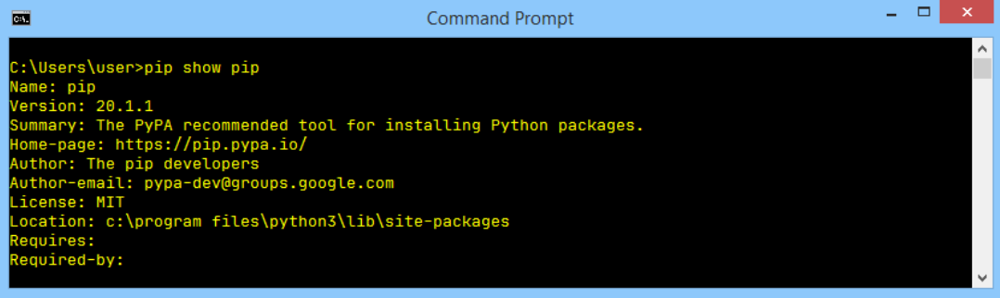

# How to use _pip_

Now we’re ready to ask `pip` what it can do for us. Let's do it – issue the following command:

```shell
pip help
```
and wait for _pip_'s response. This is what it looks like:



Don't forget that you may be obliged to replace `pip` with `pip3` if your environment requires this.

The list produced by pip summarizes all the available operations, and the last of them is `help`, which we've just used already.

If you want to know more about any of the listed operations, you can use the following form of pip invocation:

```shell
pip help <operation>
```

For example, the line:

```shell
pip help install
```

will show you detailed information about using and parameterizing the `install` command.

If you want to know what Python packages have been installed so far, you can use the `list` operation – just like this:

```shell
pip list
```

```
Package    Version
---------- -------
pip        20.1.1
setuptools 41.2.0
```

As you can see, there are two columns in the list, one showing the name of the installed package, and the other showing the version of the package. We can’t predict the state of your Python installation.

The only thing we know for sure is that your list contains the two lines we see on our list: pip and _setuptools_. This happens because the OS is convinced that a user wanting pip will very likely need the _setuptools_ soon. It’s not wrong.

The pip list isn't very informative, and it may happen that it won't satisfy your curiosity. Fortunately, there’s a command that can tell you more about any of the installed packages (note the word **installed**). The syntax of the command looks as follows:

```shell
pip show package_name
```

We’re going to use it in a slightly deceptive way – we want to convince pip to confess something about itself. This is how we do it:

```shell
pip show pip
```

It looks a bit odd, doesn't it? Despite this, it works fine, and pip's self-presentation looks consistent and current:



You may ask where this data comes from? Is pip really so perceptive? Not at all – the information appearing on the screen is taken from inside the package being shown. In other words, the package's creator is obliged to equip it with all the needed data (or to express it more precisely – metadata).

Look at the two lines at the bottom of the output. They show:
- which packages are needed to successfully utilize the package (`Requires:`)
- which packages need the package to be successfully utilized (`Required-by:`)

As you can see, both properties are empty. Feel free to try to use the `show` command in relation to any other installed package.

<br><br>

The power of _pip_ comes from the fact that it’s actually a gateway to the Python software universe. Thanks to that, you can browse and install any of the hundreds of ready-to-use packages gathered in the PyPI repositories. Don't forget that _pip_ is not able to store all PyPI content locally (it’s unnecessary and it would be uneconomical).

In effect, pip uses the Internet to query PyPI and to download the required data. This means that you have to have a network connection working whenever you’re going to ask pip for anything that may involve direct interactions with the PyPI infrastructure.

One of these cases occurs when you want to search through PyPI in order to find a desired package. This kind of search is initiated by the following command:

```shell
pip search anystring
```

The `anystring` provided by you will be searched in:
- the names of all the packages;
- the summary string of all the packages.

Be aware of the fact that some searches may generate a real avalanche of data, so try to be as specific as possible. For example, an innocent-looking query like this one:

```shell
pip search pip
```

produces more than 100 lines of results (try it yourself – don't take our word for it). By the way – the search is case insensitive.

If you’re not a fan of console reading, you can use the alternative way of browsing PyPI content offered by a search engine, available at https://pypi.org/search.

