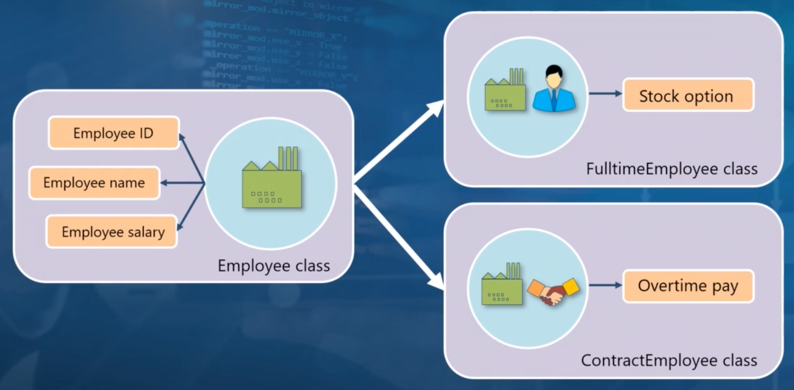
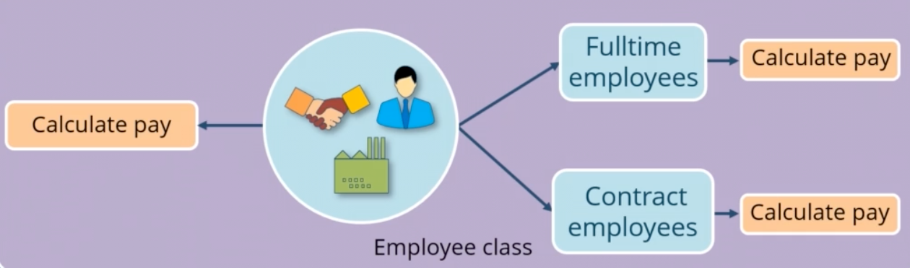

# Python Classes and Inheritance: Introduction

- discover the key concepts covered in this course
- recall how state and behavior can be encapsulated in a single unit
- describe how classes can be used as blueprints to create objects
- compare objects and instances to classes
- model is-a relationships using inheritance
- describe the advantages of using object-oriented programming
- describe classes, define how state and behavior of a class are represented, list the characteristics of class objects or instances, describe class inheritance, and list the advantages of object-oriented programming with classes

  
## Classes

- The blueprint gives you a template for the attributes a house may have and actions associated with a house
- Classes enable objects to have state (attribures) and behaviour (actions).
- A logical unit representing a real-world entity such as
    - A car, a student
    - An order on an e-commerce site
    - A ride with a ride hailing company
- State and behaviour
    - The state is represented using member variables
    - Member variables can be of any type
    - State is generally considered private to the class
    - Behavior is defined using member functions or methods
    - Member functions perform actions to:
        - Return the state of the object
        - Update the state of the object
        - Perform a calculation or display specific behavior

  
## Object
- Create an object of a class - the object has attributes and can perform actions
- Object is the same as instance - terms used interchangeably
- **Attributes** 
Attributes are properties of a class that represent its state and define its characteristics  
- There are two types of varaibles:
  - **Class variables** 
     - are associated with a class itself. Ususally holds information that holds information about all objects (static variables)
     - declared outside of any method
     - referred to by the class name
  - **Instance variables** 
     - are associated with the instance of the class.
     - typically declared within methods
     -  referred using the `self` keyword-  
 
- Instantiating a class = creating an object of a class
- Each object of a class resides in a different location in memory
- Syntax: 
  Create varaible **Student** and assign name of the class with parentasis **Student()**  
  `Student = Student()`

  
## Inheritance
- Tries to capture the similarities and differences in real-world entities
- Models entities using an is-a relationship
- Employees example of inheritance:
  - All employees have something in common (ID, name, slary), however, there are dufferent contract types and different classes represent differences for each employment type:
  

  - Employee is the **base class** or **parent class** and ContractEmployee is the **derived** class or the **subclass**
  - The FulltimeEmployee class will hold the data in the Employee class as well as what is specified in the FulltimeEmployee class. Employee is the **base class** or **parent class** and FulltimeEmployee is the **derived** class or the **subclass**.
  
- Inheritance models **IS-A** relationship
   - 

  
## Object-Oriented Programming
- Characteristics of OOP:
  - **Polimorphism**
    - The ability of an object to behave in multiple ways
    - The implementations or behaviour of the calculate pay method will be different for each of the derived classes   
  - **Encapsulation**
    - Data associated with an object of a class is hidden within the class.
    - And should only be accessed using the method of the class

 

- Benefits of OOPS:
  
  - Clear modular structure for code
  - Provides abstraction and data encapsulation
  - Easy to maintain and reuse code
  - Faster prototyping and development
  - Model real-world entities and relationships