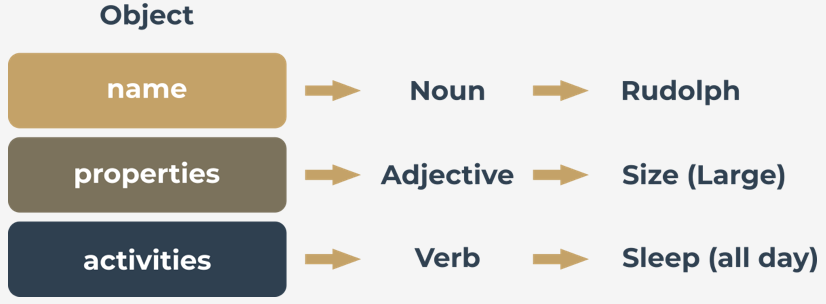
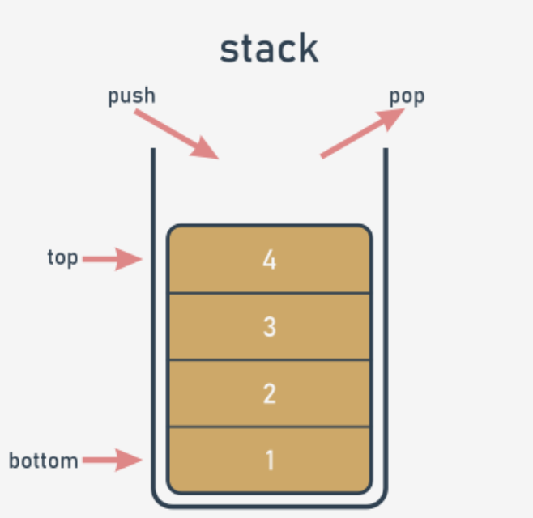

# Object Oriented programming

## The foundations of OOP
- Python is a universal tool for both object and procedural programming.
- Procedural vs. the object-oriented approach

  In the procedural approach, it's possible to distinguish two different and completely separate worlds: the world of data, and the world of code. The world of data is populated with variables of different kinds, while the world of code is inhabited by code grouped into modules and functions.
    <br><br>
  The object approach suggests a completely different way of thinking. The data and the code are enclosed together in the same world, divided into classes.
  Every class is like a recipe which can be used when you want to create a useful object (this is where the name of the approach comes from). You may produce as many objects as you need to solve your problem.

<br><br>
### Inheritance
When a class is derived from another class, their relation is named **inheritance**. The class which derives from the other class is named a **subclass**. The second side of this relation is named **superclass**. A way to present such a relation is an **inheritance diagram**, where:
- superclasses are always presented **above** their subclasses;
- relations between classes are shown as arrows directed **from the subclass toward its superclass**.

<br><br>
### What does an object have?
  The object programming convention assumes that every existing object may be equipped with three groups of attributes:
  - an object has a **name** that uniquely identifies it within its home namespace (although there may be some anonymous objects, too)
  - an object has a **set of individual properties** which make it original, unique, or outstanding (although it's possible that some objects may have no properties at all)
  - an object has a **set of abilities to perform specific activities**, able to change the object itself, or some of the other objects.

<br>
There is a hint (although this doesn't always work) which can help you identify any of the three spheres above. Whenever you describe an object and you use:

a noun – you probably define the object's name;
an adjective – you probably define the object's property;
a verb – you probably define the object's activity.



<br><br>
### Implementation
To define a Python class, you need to use the class keyword. For example:
```python
class This_Is_A_Class:
     pass
```

To create an object of the previously defined class, you need to use the class as if it were a function. For example:
```python
this_is_an_object = This_Is_A_Class()
```
<br><br><br>
## A short journey from procedural to object approach

### What is a stack?
**A stack is a structure developed to store data in a very specific way**. Imagine a stack of coins. You aren't able to put a coin anywhere else but on the top of the stack.

Similarly, you can't get a coin off the stack from any place other than the top of the stack. If you want to get the coin that lies on the bottom, you have to remove all the coins from the higher levels.

The alternative name for a stack (but only in IT terminology) is **LIFO**.

It's an abbreviation for a very clear description of the stack's behavior: **Last In - First Out**. The coin that came last onto the stack will leave first.

**A stack is an object** with two elementary operations, conventionally named **push** (when a new element is put on the top) and **pop** (when an existing element is taken away from the top).

Stacks are used very often in many classical algorithms, and it's hard to imagine the implementation of many widely used tools without the use of stacks.



Let's implement a stack in Python. This will be a very simple stack, and we'll show you how to do it in two independent approaches: procedural and objective.

Let's start with the first one.

**The stack - the procedural approach**

First, you have to decide how to store the values which will arrive onto the stack. We suggest using the simplest of methods, and employing a list for this job. Let's assume that the size of the stack is not limited in any way. Let's also assume that the last element of the list stores the top element.

```python
stack = []

def push(val):
    stack.append(val)

def pop():
    val = stack[-1]
    del stack[-1]
    return val

push(3)
push(2)
push(1)

print(pop())
print(pop())
print(pop())
```


<br><br><br>
**The stack - the OOP approach**


```python
class Stack:
    def __init__(self):
        self.__stack_list = []

stack_object = Stack()
print(len(stack_object.__stack_list))
```
<br>

**Private variables**

When any class component has a **name starting with two underscores (__), it becomes private** - this means that it can be accessed only from within the class.

You cannot see it from the outside world. This is how Python implements the **encapsulation** concept.

Run the program to test our assumptions - an `AttributeError` exception should be raised.


**The object approach: a stack from scratch**

```python
class Stack:
    def __init__(self):
        self.__stack_list = []


    def push(self, val):
        self.__stack_list.append(val)


    def pop(self):
        val = self.__stack_list[-1]
        del self.__stack_list[-1]
        return val


stack_object = Stack()

stack_object.push(3)
stack_object.push(2)
stack_object.push(1)

print(stack_object.pop())
print(stack_object.pop())
print(stack_object.pop())
```
<br><br>
**Extend stack class with subclass**

- Add a new class for handling stacks.

- The new class should be able to evaluate the sum of all the elements currently stored on the stack.

- `Stack.__init__(self)`

    Contrary to many other languages, Python forces you to explicitly invoke a superclass's constructor. Omitting this point will have harmful effects - the object will be deprived of the __stack_list list. Such a stack will not function properly.

    you have to point to the object (the class's instance) which has to be initialized by the constructor - this is why you have to specify the argument and use the `self` variable here; note: **invoking any method (including constructors) from outside the class never requires you to put the `self` argument at the argument's list** - invoking a method from within the class demands explicit usage of the `self` argument, and it has to be put first on the list.

```python
class Stack:
    def __init__(self):
        self.__stack_list = []

    def push(self, val):
        self.__stack_list.append(val)

    def pop(self):
        val = self.__stack_list[-1]
        del self.__stack_list[-1]
        return val
#######################################
class AddingStack(Stack):
    def __init__(self):
        Stack.__init__(self)
        self.__sum = 0

    def get_sum(self):
        return self.__sum

    def push(self, val):
        self.__sum += val
        Stack.push(self, val)

    def pop(self):
        val = Stack.pop(self)
        self.__sum -= val
        return val
#######################################
stack_object = AddingStack()

for i in range(5):
    stack_object.push(i)
print(stack_object.get_sum())

for i in range(5):
    print(stack_object.pop())
```

<br><br>

## Propoerties

### Instance variables
In general, a class can be equipped with two different kinds of data to form a class's properties. You already saw one of them when we were looking at stacks.

This kind of class property exists when and only when it is explicitly created and added to an object. As you already know, this can be done during the object's initialization, performed by the constructor.

Moreover, it can be done in any moment of the object's life. Furthermore, any existing property can be removed at any time.

Such an approach has some important consequences:

- different objects of the same class **may possess different sets of properties**;
- there must be a way to **safely check if a specific object owns the property** you want to utilize (unless you want to provoke an exception - it's always worth considering)
- each object c**arries its own set of properties** - they don't interfere with one another in any way.

Such variables (properties) are called **instance variables**.

The word instance suggests that they are closely connected to the objects (which are class instances), not to the classes themselves. Let's take a closer look at them.

Here is an example:

```python
class ExampleClass:
    def __init__(self, val = 1):
        self.first = val

    def set_second(self, val):
        self.second = val


example_object_1 = ExampleClass()
example_object_2 = ExampleClass(2)

example_object_2.set_second(3)

example_object_3 = ExampleClass(4)
example_object_3.third = 5

print(example_object_1.__dict__)
print(example_object_2.__dict__)
print(example_object_3.__dict__)
```
Output:
```python
{'first': 1}
{'second': 3, 'first': 2}
{'third': 5, 'first': 4}
```